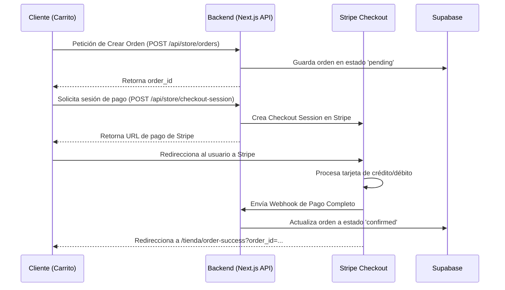

# Plan de Implementación: Mejoras de SEO y Pasarela de Pagos (Stripe Checkout)

Este plan de implementación detalla el camino técnico para corregir los problemas de SEO identificados en la tienda **Chocholand** e integrar una pasarela de pagos en línea segura y moderna utilizando **Stripe Checkout**.

---

## User Review Required

> [!IMPORTANT]
> **Dominio y Variables de Entorno en el VPS:**
> Para que el SEO y el redireccionamiento de Stripe funcionen correctamente, necesitamos configurar/verificar la variable de entorno `NEXT_PUBLIC_SITE_URL` en el VPS de Hostinger:
> *   `NEXT_PUBLIC_SITE_URL=https://pos-storeonline.duckdns.org`
>
> **Credenciales de Stripe:**
> Para habilitar Stripe Checkout en producción, se requerirá configurar dos variables secretas (que tú proporcionarás o configurarás en el `.env.local` / `.env.production` del servidor):
> *   `NEXT_PUBLIC_STRIPE_PUBLISHABLE_KEY` (Clave pública de Stripe)
>   `STRIPE_SECRET_KEY` (Clave secreta de Stripe)
>   `STRIPE_WEBHOOK_SECRET` (Clave de firmas de webhooks de Stripe)

---

## Proposed Changes

### Fase 1: SEO Técnico y Corrección de Dominio

Modificaremos los archivos de generación de rutas públicas para asegurar que Google indexe el sitio bajo el dominio real `https://pos-storeonline.duckdns.org`.

#### [MODIFY] [sitemap.ts](file:///C:/Users/kurtd/visual%20studio%20code/pos-v2/src/app/sitemap.ts)
*   Cambiar el valor fallback de `SITE_URL` para que apunte a `https://pos-storeonline.duckdns.org` en lugar de `https://chocholand.com`.

#### [MODIFY] [robots.ts](file:///C:/Users/kurtd/visual%20studio%20code/pos-v2/src/app/robots.ts)
*   Cambiar el valor fallback de `SITE_URL` de la misma manera que en el sitemap.

#### [MODIFY] [layout.tsx (tienda)](file:///C:/Users/kurtd/visual%20studio%20code/pos-v2/src/app/tienda/layout.tsx)
*   Enriquecer la metadata del layout de la tienda agregando:
    *   `alternates.canonical` dinámico.
    *   Metadatos Open Graph (`openGraph`) y Twitter Card (`twitter`) globales para que la tienda se visualice de forma atractiva al ser compartida.

#### [MODIFY] [page.tsx (tienda)](file:///C:/Users/kurtd/visual%20studio%20code/pos-v2/src/app/tienda/page.tsx)
*   Agregar un título semántico H1 `<h1>` invisible o integrado en el diseño (orientado al SEO local en México).

---

### Fase 2: Homogeneización de la Interfaz (UI/UX)

Reemplazaremos los cargadores circulares simples por skeletons premium con efecto shimmer.

#### [MODIFY] [page.tsx (tienda)](file:///C:/Users/kurtd/visual%20studio%20code/pos-v2/src/app/tienda/page.tsx)
*   Modificar las secciones de `OfertasSection` y `PaquetesSection` para usar cargadores de esqueleto similares a `ProductGridSkeleton` en lugar del spinner `spin 0.7s`.

---

### Fase 3: Integración de Pasarela de Pagos (Stripe Checkout)

Implementaremos **Stripe Checkout**, una pasarela segura y pre-construida hospedada por Stripe. Esto simplifica drásticamente el flujo ya que Stripe maneja el formulario de tarjetas, prevención de fraudes y 3D Secure sin que tengamos que escribir código complejo en el frontend.

#### Flujo de Compra Propuesto:

#### [NEW] [checkout-session/route.ts](file:///C:/Users/kurtd/visual%20studio%20code/pos-v2/src/app/api/store/checkout-session/route.ts)
*   Crear ruta POST API para iniciar la sesión en Stripe Checkout.
*   Enviará los artículos del carrito convertidos en la estructura de precios de Stripe (`line_items`) y adjuntará el `order_id` en los metadatos.

#### [NEW] [stripe/route.ts](file:///C:/Users/kurtd/visual%20studio%20code/pos-v2/src/app/api/store/webhooks/stripe/route.ts)
*   Crear endpoint de Webhooks para escuchar eventos de Stripe.
*   Al recibir el evento `checkout.session.completed`, actualizará el `status` de la orden en la tabla `store_orders` de `'pending'` a `'confirmed'` en Supabase.

#### [MODIFY] [page.tsx (carrito)](file:///C:/Users/kurtd/visual%20studio%20code/pos-v2/src/app/tienda/carrito/page.tsx)
*   En el modal de confirmación, añadir una opción de pago:
    1.  **Confirmar y pagar por WhatsApp** (mantiene el flujo actual).
    2.  **Pagar con Tarjeta (Línea)** (redirecciona a Stripe Checkout).
*   Si se elige Stripe: primero llama a crear la orden y luego redirige a la URL de pago de Stripe.

#### [NEW] [page.tsx (order-success)](file:///C:/Users/kurtd/visual%20studio%20code/pos-v2/src/app/tienda/order-success/page.tsx)
*   Página de confirmación de pago exitoso. Muestra detalles del pedido, un mensaje de agradecimiento y un enlace para seguir comprando.

---

## Verification Plan

### Pruebas Automatizadas y de API
- **Verificación de Sitemap y Robots:** Consultar localmente `/sitemap.xml` y `/robots.txt` para comprobar que las URLs apuntan al dominio correcto.
- **Flujo de Pago en Modo Sandbox (Stripe Test):** 
  - Simular el checkout utilizando tarjetas de prueba de Stripe (tarjeta 4242).
  - Verificar que el webhook actualice el estado del pedido en la base de datos de Supabase a `confirmed`.

### Pruebas Manuales
- Validar el responsive del modal de confirmación de compra y del checkout de Stripe.
- Comprobar la redirección fluida de regreso a la tienda tras el pago exitoso.
